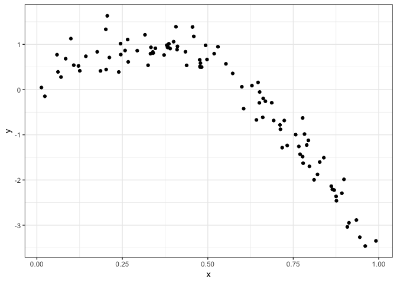
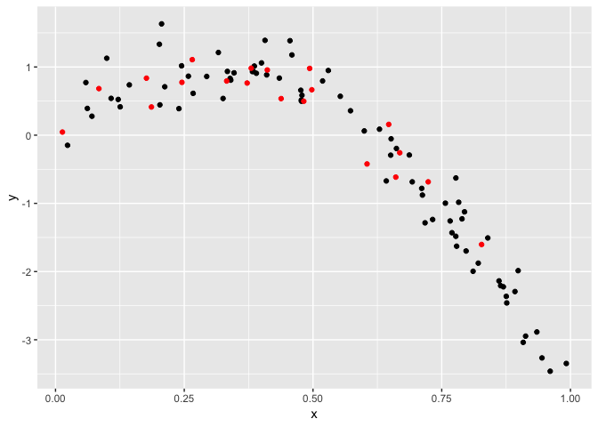
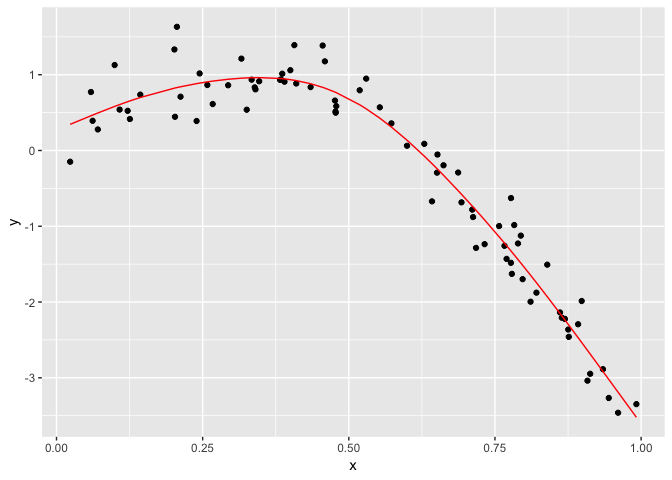
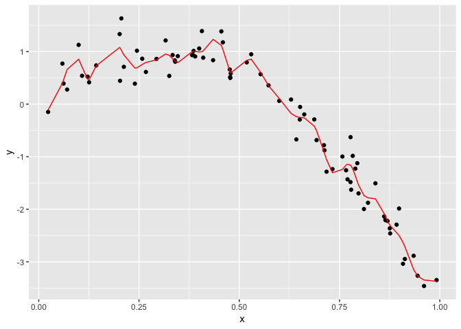
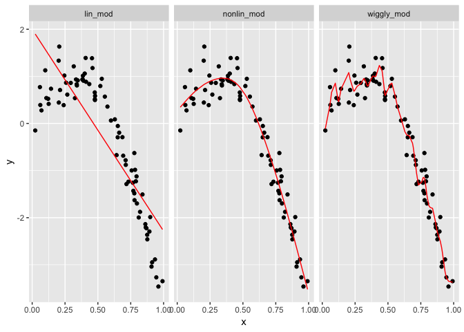
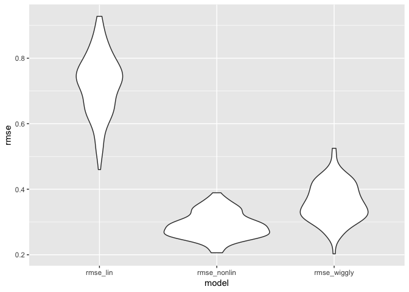
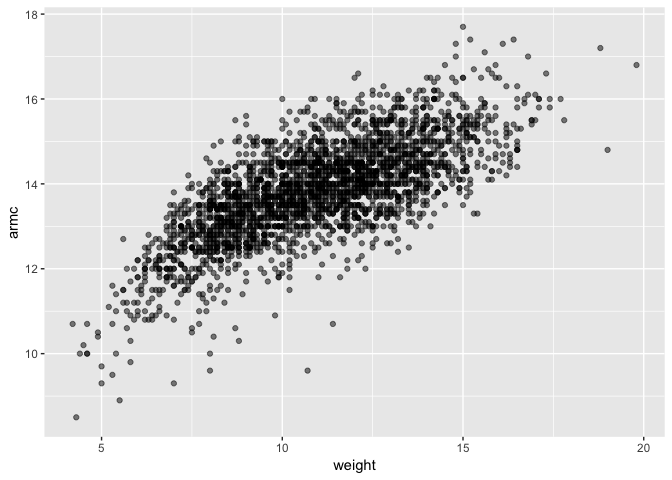
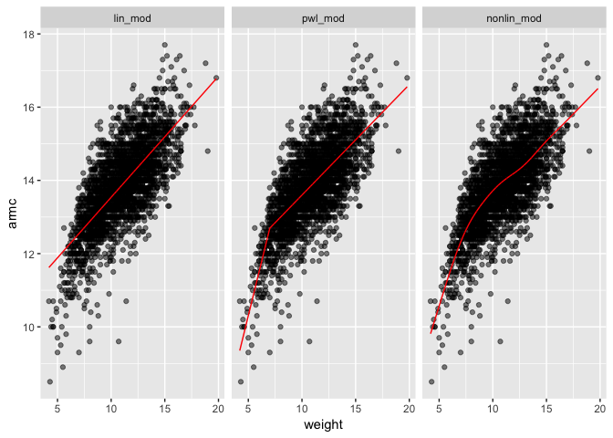
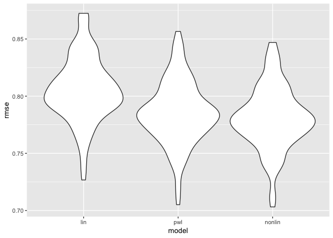

Cross Validation
================
Eric Morris
11/13/2018

Simulate Data

``` r
nonlin_df = tibble(
  id = 1:100,
  x = runif(100, 0, 1),
  y = 1 - 10 * (x - .3) ^ 2 + rnorm(100, 0, .3)
)

ggplot(nonlin_df, aes(x = x, y = y)) + geom_point() + theme_bw()
```



Partition into training and testing

``` r
train_df = sample_n(nonlin_df, 80)
test_df = anti_join(nonlin_df, train_df, by = "id")

ggplot(train_df, aes(x = x, y = y)) + 
  geom_point() + 
  geom_point(data = test_df, color = "red")
```



Fit a few models

``` r
lin_mod = lm(y ~ x, data = train_df)
nonlin_mod = mgcv::gam(y ~ s(x), data = train_df)
wiggly_mod = mgcv::gam(y ~ s(x, k = 30), sp = 10e-6, data = train_df)
```

What do these models look like?

``` r
train_df %>% 
  add_predictions(nonlin_mod) %>% 
  ggplot(aes(x = x, y = y)) + geom_point() + 
  geom_line(aes(y = pred), color = "red")
```



``` r
train_df %>% 
  add_predictions(wiggly_mod) %>% 
  ggplot(aes(x = x, y = y)) + geom_point() + 
  geom_line(aes(y = pred), color = "red")
```



Gathering predictions/models, putting all the plots together

``` r
train_df %>% 
  gather_predictions(lin_mod, nonlin_mod, wiggly_mod) %>% 
  mutate(model = fct_inorder(model)) %>% 
  ggplot(aes(x = x, y = y)) + 
  geom_point() + 
  geom_line(aes(y = pred), color = "red") + 
  facet_wrap(~model)
```



``` r
rmse(lin_mod, test_df)
```

    ## [1] 0.7163422

``` r
rmse(nonlin_mod, test_df)
```

    ## [1] 0.2437012

``` r
rmse(wiggly_mod, test_df)
```

    ## [1] 0.3471883

Cross Validation using modelr

``` r
cv_df = 
  crossv_mc(nonlin_df, 100) #generates partitions (with defaul 80/20 split)
```

``` r
#cv_df %>% pull(train) %>% .[[1]] %>% as_tibble

cv_df %>% pull(test) %>% .[[1]] %>% as_tibble
```

    ## # A tibble: 21 x 3
    ##       id      x       y
    ##    <int>  <dbl>   <dbl>
    ##  1     4 0.908  -3.04  
    ##  2     6 0.898  -1.99  
    ##  3    10 0.0618  0.392 
    ##  4    13 0.687  -0.291 
    ##  5    15 0.770  -1.43  
    ##  6    17 0.718  -1.29  
    ##  7    23 0.652  -0.0535
    ##  8    42 0.647   0.158 
    ##  9    46 0.789  -1.23  
    ## 10    50 0.693  -0.684 
    ## # ... with 11 more rows

``` r
cv_df =
  cv_df %>% 
  mutate(train = map(train, as_tibble),
         test = map(test, as_tibble))
```

``` r
cv_df = 
  cv_df %>% 
  mutate(lin_mod    = map(train, ~lm(y ~ x, data = .x)),
         nonlin_mod = map(train, ~mgcv::gam(y ~ s(x), data = .x)),
         wiggly_mod = map(train, ~gam(y ~ s(x, k = 30), sp = 10e-6, data = .x))) %>% 
  mutate(rmse_lin    = map2_dbl(lin_mod, test, ~rmse(model = .x, data = .y)),
         rmse_nonlin = map2_dbl(nonlin_mod, test, ~rmse(model = .x, data = .y)),
         rmse_wiggly = map2_dbl(wiggly_mod, test, ~rmse(model = .x, data = .y)))
```

Summarize results

``` r
cv_df %>% 
  select(.id, starts_with("rmse")) %>% 
  gather(key = model, value = rmse, rmse_lin:rmse_wiggly) %>% 
  ggplot(aes(x = model, y = rmse)) + 
  geom_violin()
```



Child growth example

``` r
child_growth = read_csv("./data/nepalese_children.csv")
```

    ## Parsed with column specification:
    ## cols(
    ##   age = col_integer(),
    ##   sex = col_integer(),
    ##   weight = col_double(),
    ##   height = col_double(),
    ##   armc = col_double()
    ## )

``` r
child_growth %>% 
  ggplot(aes(x = weight, y = armc)) + 
  geom_point(alpha = .5)
```



Is this data linear or nonlinear?

``` r
child_growth = 
  child_growth %>% 
  mutate(weight_sp = (weight > 7) * (weight - 7))
```

Fit three models:

``` r
lin_mod = lm(armc ~ weight, data = child_growth)
pwl_mod = lm(armc ~ weight + weight_sp, data = child_growth)
nonlin_mod = gam(armc ~ s(weight), data = child_growth)
```

PLot all model fits:

``` r
child_growth %>% 
  gather_predictions(lin_mod, pwl_mod, nonlin_mod) %>% 
  mutate(model = fct_inorder(model)) %>% 
  ggplot(aes(x = weight, y = armc)) + 
  geom_point(alpha = .5) +
  geom_line(aes(y = pred), color = "red") + 
  facet_grid(~model)
```



Constructing training/testing splits

``` r
cv_df =
  crossv_mc(child_growth, 100) %>% 
  mutate(train = map(train, as_tibble),
         test = map(test, as_tibble))
```

Now fit models and get RMSEs

``` r
cv_df = 
  cv_df %>% 
  mutate(lin_mod = map(train, ~lm(armc ~ weight, data = .x)),
         pwl_mod = map(train, ~lm(armc ~ weight + weight_sp, data = .x)),
         nonlin_mod = map(train, ~gam(armc ~ s(weight), data = as_tibble(.x)))) %>% 
  mutate(rmse_lin    = map2_dbl(lin_mod, test, ~rmse(model = .x, data = .y)),
         rmse_pwl = map2_dbl(pwl_mod, test, ~rmse(model = .x, data = .y)),
         rmse_nonlin = map2_dbl(nonlin_mod, test, ~rmse(model = .x, data = .y)))
```

PLotting prediction error distro:

``` r
cv_df %>% 
  select(starts_with("rmse")) %>% 
  gather(key = model, value = rmse) %>% 
  mutate(model = str_replace(model, "rmse_", ""),
         model = fct_inorder(model)) %>% 
  ggplot(aes(x = model, y = rmse)) + geom_violin()
```


